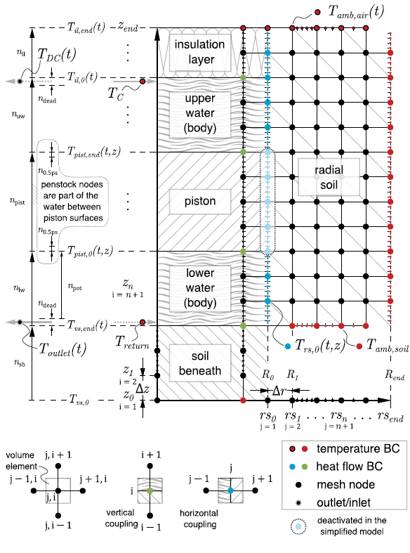
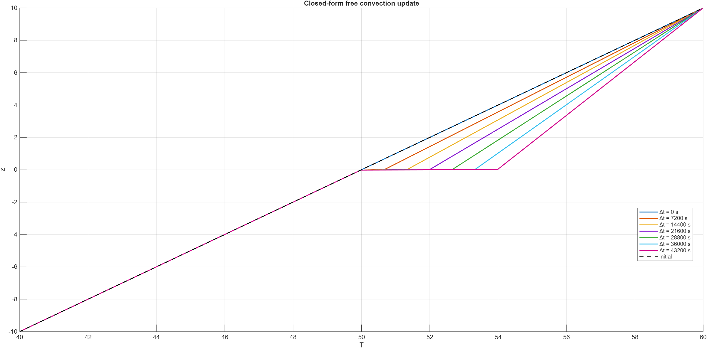

# Model Overview – Thermal Pumped Piston Storage (TPPS)

This document provides an overview of the physical and mathematical TPPS model.

## 1. Domains
- Water
- Solid (piston, soil, insulation)
- Penstock / inlet pipe

## 2. Governing Equations

### 2.1 Water Domain
One dimensional heat transport equation **with** residual terms: 

$$
\rho_w \, c_w \, \frac{\partial T_w(z; t)}{\partial t}
= \lambda_w \, \frac{\partial^2 T_w(z; t)}{\partial z^2}
- \rho_w \, v_{z} \, c_w \, \frac{\partial T_w(z; t)}{\partial z}
+ \dot{q}_{\text{conv, free}}
+ \sigma_{\text{piston}}
+ \sigma_{\text{wall}}
\tag{1}
$$

Terms:
- $-\rho_w \, v_{z} \, c_w \, \partial T / \partial z$ → forced convection (if present). Shifts temperature profile to in accordance with sign of vertical (axial) velocitcy $v_z$. Is active between inlet and outlet.
- $\lambda_w \frac{\partial^2 T_w(z,t)}{\partial z^2}$ → diffusive heat transport 
- $\dot{q}_{\text{conv, free}}$ → natural convection term (to be developed in the thesis)  
- $\sigma_{\text{piston}}$, $\sigma_{\text{wall}}$ → coupling terms to piston and soil (see Häuslein, 2024)

### 2.2 Solid Domain
One dimensional heat transport equation in **solid** systems:

$$
\rho_s \, c_s \frac{\partial T_s(z; t)}{\partial t} = \lambda_s \frac{\partial^2 T_s(z; t)}{\partial z^2}
\tag{2}
$$

Two dimensional (axial=z and radial=r) heat transport equation

$$
\rho_s \, c_s \frac{\partial T_s(z, r; t)} {\partial t}
=
\lambda_s \left(
\frac{\partial^2 T_s(z,r; t)}{\partial z^2}
+
\frac{1}{r}\,\frac{\partial}{\partial r}
\left(
r\,\frac{\partial T_s(z, r; t)}{\partial r}
\right)
\right)
\tag{3}
$$

### 2.3 Coupling Terms ($\sigma$-terms)

Coupling terms represent heat transfer between adjacent domains.
They appear as source/sink terms in each energy balance equation.

#### Example of water and insulation
At the contact between water ($W$) and insulation ($D$), the heat flux must be continuous. Using Fourier's law on both sides yields
$$
q = -\lambda_W \frac{T_K - T_W}{\Delta x_W},
\qquad
q = -\lambda_D \frac{T_D - T_K}{\Delta x_D},
$$
where $T_W$ and $T_D$ denote the temperatures of the nodes adjacent to the interface (water and insulation side), $T_K$ is the (unknown) contact temperature, $\lambda_W,\lambda_D$ are thermal conductivities, and $\Delta x_W,\Delta x_D$ are distances from the nodes to the interface.

Flux continuity implies
$$
\lambda_W \frac{T_K - T_W}{\Delta x_W}
=
\lambda_D \frac{T_D - T_K}{\Delta x_D}.
$$

#### Algebraic derivation of the contact temperature
Rearranging gives
$$
\left(\frac{\lambda_W}{\Delta x_W}+\frac{\lambda_D}{\Delta x_D}\right)T_K
=
\frac{\lambda_W}{\Delta x_W}T_W+\frac{\lambda_D}{\Delta x_D}T_D,
$$
hence
$$
T_K
=
\frac{\frac{\lambda_W}{\Delta x_W}T_W+\frac{\lambda_D}{\Delta x_D}T_D}
{\frac{\lambda_W}{\Delta x_W}+\frac{\lambda_D}{\Delta x_D}}.
$$
For equal half-cell distances $\Delta x_W=\Delta x_D$, this reduces to the common conductivity-weighted mean
$$
T_K
=
\frac{\lambda_W T_W+\lambda_D T_D}{\lambda_W+\lambda_D}.
$$

#### Link to the implemented coupling coefficient $\texttt{SW(:,4)}$
In the implementation, the interface weighting is not based on $\lambda$ (or $\lambda/\Delta x$) but on the coefficient
$$
b := \sqrt{\lambda\,\rho\,c_p},
$$
i.e.\ $\texttt{SW(1,4)}=\sqrt{\lambda_W\rho_W c_{p,W}}$ for water and $\texttt{SW(3,4)}=\sqrt{\lambda_D\rho_D c_{p,D}}$ for insulation. This quantity has units
$$
[b] = \mathrm{J\,m^{-2}\,K^{-1}\,s^{-1/2}}
$$
and is commonly referred to as the $\emph{thermal effusivity}=\emph{Wärmeeindringkoeffizient}$ (it governs transient heat exchange with **semi-infinite bodies**).

Using this coefficient, the contact temperature is computed as the effusivity-weighted mean
$$
T_K
=
\frac{b_W T_W + b_D T_D}{b_W+b_D}
=
\frac{\sqrt{\lambda_W\rho_W c_{p,W}}\,T_W+\sqrt{\lambda_D\rho_D c_{p,D}}\,T_D}
{\sqrt{\lambda_W\rho_W c_{p,W}}+\sqrt{\lambda_D\rho_D c_{p,D}}}.
$$
This choice implicitly accounts for both heat conduction ($\lambda$) and thermal storage ($\rho c_p$) at the interface, which is consistent with transient contact problems and the semi-infinite plate interpretation.

This expression is valid for all times for semi-infinite bodies in perfect thermal contact. It is also a good first guess for the initial contact temperature for finite bodies. It is used for the **green dots** in the sketch in Häuslein's (2024) paper.

#### Different treatment of water-soil and water-insulation
In the present model, the water–soil and water–insulation couplings are **not implemented as explicit source/sink terms in dT/dt**, but as **algebraic interface conditions**.  
The interface layer itself is assumed to have **no thermal mass???** and therefore stores no energy; it only enforces **instantaneous heat-flux continuity** between the adjacent domains.  
Mathematically, these are still **Robin-type interface conditions**, but they are realized by directly reconstructing the contact temperature \(T_K\) instead of integrating an additional ODE.  
- Temperature gradients at water-soil and water-insulation are zero, they become set every time the ODE is solved for one iteration step.

#### Radial loss terms (Eq. 6+7)

---

### 2.4 Dimensionless Quantities (Derivation + Relevance)

**Reynolds Number (Re):**
$$
\mathrm{Re} = \frac{v\,L}{\nu}
$$
with  
- $v$ : characteristic flow velocity [m/s]  
- $L$ : characteristic length of the body (e.g. hydraulic diameter, gap width) [m]  
- $\nu$ : kinematic viscosity of water (higher number the stiffer the material) [$m^2$/s]

**Physical meaning:**  
Ratio of inertial to viscous forces (Trägheit zur Zähigkeit). Determines whether the flow is laminar or turbulent.

**Typical regimes (water):**  
- $\mathrm{Re} \ll 1$ : creeping (Stokes) flow  
- $\mathrm{Re} \lesssim 2{,}300$ : laminar pipe flow  
- $\mathrm{Re} \gtrsim 4{,}000$ : turbulent flow

**Relevance for this work:**  
Characterizes forced convection during charging and discharging processes. Reynolds number alone is insufficient when buoyancy effects are significant.

---

**Rayleigh Number (Ra):**
$$
\mathrm{Ra} = \frac{g\,\beta\,\Delta T\,L^3}{\nu\,\alpha}
$$
with  
- $g$ : gravitational acceleration [m/$s^2$]  
- $\beta$ : thermal expansion coefficient [1/K]  
- $\Delta T$ : characteristic temperature difference [K]  
- $L$ : characteristic length scale (e.g. wall height, gap height) [m]  
- $\alpha$ : thermal diffusivity [$m^2$/s]

**Physical meaning:**  
Measures the strength of buoyancy-driven (free) convection relative to thermal and viscous diffusion within fluids.

**Typical regimes:**  
- $\mathrm{Ra} < 10^3$ : heat transfer dominated by conduction/diffusion 
- $10^3 \lesssim \mathrm{Ra} \lesssim 10^7$ : laminar natural convection  
- $\mathrm{Ra} \gtrsim 10^7$ : turbulent natural convection

**Relevance for this work:**  
Governs wall-driven downward flows caused by cooling at the storage wall. Even for large systems, local Rayleigh numbers can be high in wall boundary layers.

---

**Froude Number (Fr):**
$$
\mathrm{Fr} = \frac{v}{\sqrt{g\,L}}
$$
with  
- $v$ : characteristic flow velocity [m/s]  
- $L$ : characteristic length scale (e.g. stratification height) [m]
- $g$ : gravitational force (e.g. stratification height) [m/$s^2$]

**Physical meaning:**  
Ratio of inertial forces to gravitational forces.

**Typical regimes:**  
- $\mathrm{Fr} \ll 1$ : gravity-dominated flow, stable stratification  
- $\mathrm{Fr} \sim 1$ : significant interface deformation and mixing

**Relevance for this work:**  
Relevant for high mass-flow charging or discharging events. Typically small in thermally stratified water storage systems.

---

**Richardson Number (Ri):**
$$
\mathrm{Ri} = \frac{g\,\beta\,\Delta T\,L}{v^2} = \frac{\mathrm{Gr}}{\mathrm{Re}^2} ? \frac{1}{Fr^2}
$$
with  
- $g$ : gravitational acceleration [m/s$^2$]  
- $\beta$ : thermal expansion coefficient [1/K]  
- $\Delta T$ : temperature difference between fluid layers [K]  
- $L$ : characteristic vertical length scale [m]  
- $v$ : characteristic flow velocity [m/s]

**Physical meaning:**  
Ratio of buoyancy forces to inertial forces. Indicates the stability of thermal stratification.

**Typical regimes:**  
- $\mathrm{Ri} \ll 1$ : forced convection dominates, strong mixing  
- $\mathrm{Ri} \approx 1$ : transition regime  
- $\mathrm{Ri} \gg 1$ : buoyancy-dominated flow, stable stratification

**Relevance for this work:**  
Key parameter for assessing whether inflowing water leads to stratification or mixing during charging and discharging.

**Relation to Archimedes Number:**
The Archimedes number is the ratio of gravitational forces to viscous forces.
$$
\mathrm{Ar} = \frac{g\, \rho \,\Delta \rho\,L^3}{\eta^2}
$$
with  
- $g$ : gravitational acceleration [m/$s^2$]  
- $\Delta \rho$ : density difference between fluid and body [kg/$m^3$]  
- $L^3$ : volume calculated out of charateristic length [$m^3$]  
- $\eta$ : dynamische Viskosität [m]  
- $v$ : characteristic flow velocity [m/s]

**Alternative representation of the Archimedes number:**
$$
\mathrm{Ar} = \frac{\mathrm{Gr}}{\mathrm{Re}^2}
$$

with

$
\mathrm{Gr} = \frac{g\,\beta\,\Delta T\,L^3}{\nu^2},
\qquad
\mathrm{Re} = \frac{U L}{\nu}
$

#### Equivalence

Substituting $\mathrm{Gr}$ and $\mathrm{Re}$ into $\mathrm{Ar}$:

$
\mathrm{Ar}
= \frac{g\,\beta\,\Delta T\,L^3 / \nu^2}{U^2 L^2 / \nu^2}
= \frac{g\,\beta\,\Delta T\,L}{v^2}
= \mathrm{Ri}
$

Thus, the Archimedes number and the Richardson number are **mathematically identical**, up to the
choice of characteristic length $L$.

**Conclusion:**  
For a 1D stratified storage model with buoyancy-based mixing closure, the Richardson number fully
justifies the dominance of natural convection and the modeling approach.

---

**Prandtl Number (Pr):**
$$
\mathrm{Pr} = \frac{\nu}{\alpha}
$$
with  
- $\nu$ : kinematic viscosity [$m^2$/s]  
- $\alpha$ : thermal diffusivity [$m^2$/s]

**Physical meaning:**  
Ratio of momentum diffusivity to thermal diffusivity. It indicates whether velocity or temperature gradients dominate the transport processes.

**Typical regimes:**  
- $\mathrm{Pr} \ll 1$ : thermal diffusion dominates (e.g. liquid metals)  
- $\mathrm{Pr} \sim 1$ : momentum and thermal diffusion comparable (e.g. gases)  
- $\mathrm{Pr} \gg 1$ : momentum diffusion dominates (e.g. liquids)

**Relevance for this work:**  
For water in the relevant temperature range, $\mathrm{Pr} \approx 5\text{--}7$. This implies that thermal boundary layers are thicker than velocity boundary layers. Consequently, temperature gradients persist even when velocity gradients are already damped, which favors buoyancy-driven wall flows in thermally stratified water storages.

---

**Relation between dimensionless numbers:**
$$
\mathrm{Ri} = \frac{\mathrm{Ra}}{\mathrm{Re}^2}\,\mathrm{Pr}^{-1}
$$

**Interpretation:**  
- $\mathrm{Re}$ quantifies the strength of forced convection  
- $\mathrm{Ra}$ quantifies the strength of buoyancy-driven convection  
- $\mathrm{Ri}$ determines which mechanism dominates the flow behavior

---

## 3. Extension: Natural Convection (Thesis Objective)
Natural convection will be introduced into the 1D water equation.
 Approach: No fluid transport via a flow but energy entrance per volume element, per incremental time unit.

### 3.1 Energy Balance Approach for Natural Convection (Gerle, Schäfer)
Thermal energy per volume to arbitrary reference point, differentiated by time under the assumption of a an incompressible fluid:
$$
\begin{aligned}
& q_{\text{conv, free}} = \rho_w \, c_w \, T \\
\iff & \frac{\partial}{\partial t} \,q = \frac{\partial}{\partial t} \,[\rho_w \, c_w T_w] \\
\iff & \dot{q}_{\text{conv, free}} = \rho_w \, c_w \, \frac{\partial T_w}{\partial t} \tag{4}
\end{aligned}
$$
which corresponds to equation (3) in Schäfer (2021). 

#### Linear approach for the mixed temperature

During a mixing event (natural convection), the new temperature
distribution in the mixing zone $ z \in [z_{\text{in}}, z_{\text{mix}}] $
is assumed to be linear:

$$
T_w^*(z) = a z + b
\tag{5}
$$
Note as well that $T_w^* = T_w(z, t+dt)$ and is thus the temperature distribution after an infinitesimal timestep $dt$. 

---

#### Determination of intercept $b$ via boundary condition
The boundary condition at the top of the mixing zone is given by:

$$
T_w^*(z_{mix}) = T_{w,\text{in}}
\tag{6}
$$

Using (5) in (6):

$$
a z_{\text{mix}} + b = T_{w,\text{in}}
\quad\Rightarrow\quad
b = T_{w,\text{in}} - a z_{\text{mix}}
\tag{7}
$$

Insert (7) into (5):

$$
T_w^*(z)
= T_{w,\text{in}} + a (z - z_{\text{mix}})
\tag{8}
$$

---

#### Integration of the new temperature profile

We integrate (8) over the mixing zone:

$$
\int_{z_{\text{in}}}^{z_{\text{mix}}} T_w^*(z)\,dz
=
\int_{z_{\text{in}}}^{z_{\text{mix}}}
\left[ T_{w,\text{in}} + a(z - z_{\text{mix}}) \right] dz
\tag{9}
$$

The integral of the linear term is:

$$
\int_{z_{\text{in}}}^{z_{\text{mix}}} (z - z_{\text{mix}})\,dz
=
-\,\frac{(z_{\text{mix}} - z_{\text{in}})^2}{2}
\tag{10}
$$

We define:

$$
I := \int_{z_{\text{in}}}^{z_{\text{mix}}}
\left( T_{w,\text{in}} - T_w(z) \right) dz
\tag{11}
$$

---

#### Energy balance to determine the slope $a$

The energy added by the inflowing hot water must equal the
internal energy increase of the mixing region:

$$
\begin{aligned}
\Delta U_{w,\text{mix}}
=
& \rho_w c_w A_{\text{hws}}
\int_{z_{\text{in}}}^{z_{\text{mix}}}
\left( T_w^*(z) - T_w(z) \right) dz \\
\iff 
& \rho_w c_w A_{\text{hws}}
\int_{z_{\text{in}}}^{z_{\text{mix}}}
\left( T_{w,\text{in}} + a (z - z_{\text{mix}}) - T_w(z) \right) dz
=
\dot Q_{\text{mix}} \, dt
\tag{12}
\end{aligned}
$$
where the last formulation was arrived by plugging in equation (8). 
Now use (10)–(11) to solve the remaining integral:

$$
\rho_w c_w A_{\text{hws}}
\left[
I - a\frac{(z_{\text{mix}} - z_{\text{in}})^2}{2}
\right]
=
\dot Q_{\text{mix}}\, dt
\tag{13}
$$

Solve for $a$:

$$
a
=
\frac{2}{(z_{\text{mix}} - z_{\text{in}})^2}
\left[
I - \frac{\dot Q_{\text{mix}}\, dt}
       {\rho_w c_w A_{\text{hws}}}
\right]
\tag{14}
$$
Now both constants $[a, b]$ are defined by the **boundary condition** and the **energy equation**, respectively.

---

#### Update of linear approach

$$
T_w^*(z) = T_{w,\text{in}} + a(z - z_{\text{mix}}),
$$

we now insert the expression for $a$ and $b$ obtained in Equation (14) and (7):
$$
T_w^*(z)
=
T_{w,\text{in}}
+
\frac{2(z - z_{\text{mix}})}{(z_{\text{mix}} - z_{\text{in}})^2}
\left[
I - \frac{1}{\rho_w c_w A_{\text{hws}}}\,\dot Q_{\text{mix}} \, dt
\right].
\tag{15}
$$

This expresses the updated temperature field after one infinitesimal mixing step in terms of the integral $I$, the inflow energy $\dot Q_{\text{mix}} dt$, and the geometric mixing factor.

---

#### Temperature increase and definition of the mixing function

The incremental temperature increase in the mixing zone is:

$$
\begin{aligned}
\Delta T(z)
&= T_w^*(z) - T_w(z) \\
&=T_{w,\text{in}} + \frac{2(z - z_{\text{mix}})}{(z_{\text{mix}} - z_{\text{in}})^2}
\left[
I - \frac{1}{\rho_w c_w A_{\text{hws}}}\,\dot Q_{\text{mix}} \, dt
\right]
- T_w(z)
\tag{16}
\end{aligned}
$$

where equation (15) has been plugged in.

---

#### Final mixing source term (Equation 8 in Schäfer 2021)

Using Equation (4) in its discretized form:

$$
\dot{q}_{\text{conv, free}} = \rho_w c_w \frac{\Delta T(z)}{\Delta t}
\tag{17}
$$

Insert (16) into (17) to obtain:

$$
\boxed{
\dot{q}_{\text{conv, free}}(z) =
\frac{\rho_w c_w}{\Delta t}
\left(
\frac{2(z-z_{\text{mix}})}{(z_{\text{mix}}-z_{\text{in}})^2}
\int_{z_{\text{in}}}^{z_{\text{mix}}}
T_{w,\text{in}} - T_w(z)\,dz
\right)
+
\frac{\rho_w c_w}{\Delta t}(T_{w,\text{in}} - T_w(z))
-
\dot Q_{\text{mix}}
\frac{2(z - z_{\text{mix}})}
     {A_{\text{hws}}(z_{\text{mix}} - z_{\text{in}})^2}
}
\tag{18}
$$

which matches Equation (8) from Schäfer et al. (2021). Note, the unit of the convecitve term is given by: $[\dot{q}_{\text{conv, free}}(z)] = \frac{W}{m^3}$. Thus, we speak of a power input per volume.

The heat flow is given by: 
 $$
 \dot{Q}_{mix} = \dot{M_w}\,c_w\,(T_{w,in}-T_{w}(z_{in}))
 $$

### 3.2. Variable Mixed Zone
The mixed zone is in the present model of dynamic size, $[z_{in}, z_{mix}(t)]$. This means in practice, every iteration step, on has to find the z value for which the temperature is equal to the inlet temperature:
 $$
 T_{w}(z_{mix}(t), t) = T_{w, in}(t)
 $$
Thus the number of cells, affected by natural convection is variable. 

### 3.3 Exemplary Calculation of new Temperature Profile based on Convective Mixing Term

**Objective:**  
Recalculation of the influence of the convective mixing term on the updated
temperature profile $T_w^*(z)$.

---

#### Given temperature profile

Initial temperature distribution:

$$
T_w(z) = 323.15~\mathrm{K} + \frac{2~\mathrm{K}}{\mathrm{m}} \, z,
\qquad z \in [0, 10]~\mathrm{m}
$$

Inlet temperature:

$$
T_{w,\mathrm{in}} = 333.15~\mathrm{K}
$$

Mixing height and inlet position:

$$
z_{\mathrm{mix}} = 10~\mathrm{m},
\qquad
z_{\mathrm{in}} = 0~\mathrm{m}
$$

---

#### Physical parameters

$$
\rho_w = 1000~\mathrm{kg\,m^{-3}};\, c_w = 4.18~\mathrm{kJ\,kg^{-1}\,K^{-1}}; \, A_{\mathrm{hws}} = 300~\mathrm{m^2}
$$

Time step:

$$
\Delta t = 1~\mathrm{s}
$$

---

#### Mass flow rate

 flow rate:

$$
\dot{v} = \frac{1}{21600}~\mathrm{m\,s^{-1}}
$$

Mass flow rate:

$$
\dot{m}_w
=
\rho_w \dot{v} A_{\mathrm{hws}}
=
1000 \cdot \frac{1}{21600} \cdot 300
=
13.8~\mathrm{kg\,s^{-1}}
$$

---

#### Heat flow into the mixing zone

$$
\dot{Q}_{\mathrm{mix}}
=
\dot{m}_w c_w
\left(
T_{w,\mathrm{in}} - T_w(z_{\mathrm{in}})
\right)
$$

Since

$$
T_w(0) = 323.15~\mathrm{K}
$$

follows:

$$
\dot{Q}_{\mathrm{mix}}
=
13.8 \mathrm{kg\,s^{-1}} \cdot 4.18 \mathrm{kJ\,kg^{-1} K^{-1}}\cdot 10 \mathrm{K}
=
577~\mathrm{kJ\,s^{-1}}
$$

---

#### Integral term of the mixing formulation

$$
\int_{z_{\mathrm{in}}}^{z_{\mathrm{mix}}}
\left(
T_{w,\mathrm{in}} - T_w(z)
\right)\,\mathrm{d}z
=
\int_0^{10}
\left(
333.15\mathrm{K} - 323.15\mathrm{K} - z\, \mathrm{K m^{-1}}
\right)\,\mathrm{d}z
$$

$$
=
\int_0^{10}
(10 \, \mathrm{K}- z\, \mathrm{K m^{-1}})\,\mathrm{d}z
=
\left[10\, \mathrm{K}\,z - 0.5\,z^2 \, \mathrm{K m^{-1}} \right]_0^{10m}
=
50~\mathrm{K\,m}
$$

---

#### Updated temperature profile

The new temperature distribution after convective mixing reads:

$$
T_w^*(z)
=
T_{w,\mathrm{in}}
+
\frac{2(z - z_{\mathrm{mix}})}{(z_{\mathrm{mix}} - z_{\mathrm{in}})^2}
\left[
\int_{z_{\mathrm{in}}}^{z_{\mathrm{mix}}}
(T_{w,\mathrm{in}} - T_w(z))\,\mathrm{d}z
-
\frac{\dot{Q}_{\mathrm{mix}}}{\rho_w c_w A_{\mathrm{hws}}}\,\Delta t
\right]
$$

Insert numerical values:

$$
T_w^*(z)
=
333.15\, \mathrm{K}
+
\frac{2(z - 10\mathrm{m})}{100 \mathrm{m^2}}
\left[
50 \mathrm{K\,m}
-
\frac{577 \Delta t}{4.18 \cdot 1000 \cdot 300} \frac{\mathrm{K\,m}}{s}
\right]
$$

$$
=
333.15\, \mathrm{K}
+
\frac{(z - 10\mathrm{m})}{m^2}
\left[
1 \, \mathrm{K\,m}
-
9.2 \cdot 10^{-6} \frac{\mathrm{K\,m}}{s}\, \Delta t
\right]
$$

---

#### Final result (z without dimension)

$$
\boxed{
T_w^*(z)
=
333.15~\mathrm{K}
+
(z - 10)
\left(
1 - 9.2 \cdot 10^{-6}\Delta t~\mathrm{s^{-1}}
\right)~\mathrm{K}
}
$$

