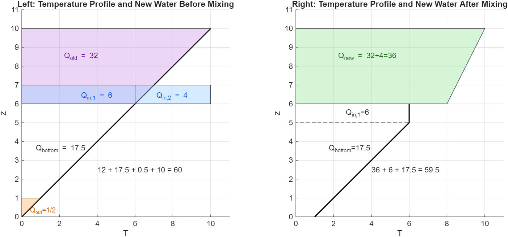
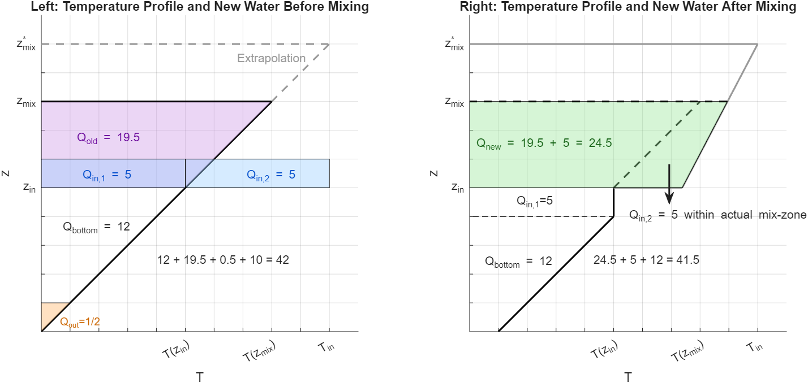
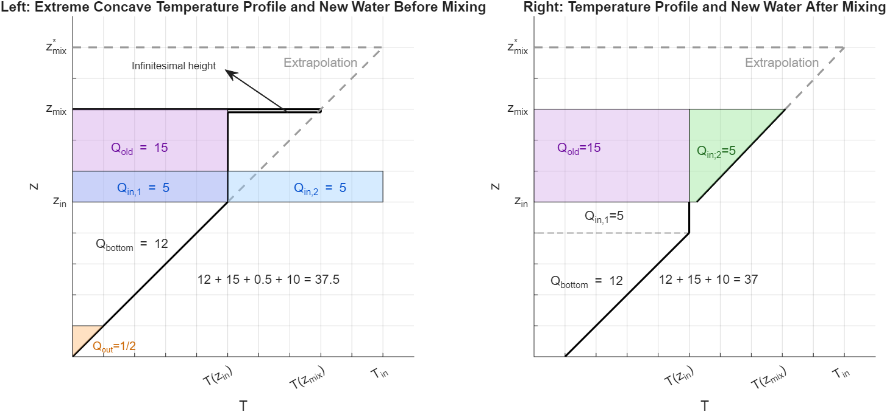

# Model Overview – Thermal Pumped Piston Storage (TPPS)

This document provides an overview of the physical and mathematical TPPS model.

## 1. Domains
- Water
- Solid (piston, soil, insulation)
- Penstock / inlet pipe

## 2. Governing Equations

### 2.1 Water Domain
One dimensional heat transport equation **with** residual terms: 

$$
\rho_w \, c_w \, \frac{\partial T_w(z; t)}{\partial t}
= \lambda_w \, \frac{\partial^2 T_w(z; t)}{\partial z^2}
- \rho_w \, v_{z} \, c_w \, \frac{\partial T_w(z; t)}{\partial z}
+ \dot{q}_{\text{conv, free}}
+ \sigma_{\text{piston}}
+ \sigma_{\text{wall}}
\tag{1}
$$

Terms:
- $-\rho_w \, v_{z} \, c_w \, \partial T / \partial z$ → forced convection (if present). Shifts temperature profile to in accordance with sign of vertical (axial) velocitcy $v_z$. Is active between inlet and outlet.
- $\lambda_w \frac{\partial^2 T_w(z,t)}{\partial z^2}$ → diffusive heat transport 
- $\dot{q}_{\text{conv, free}}$ → natural convection term (to be developed in the thesis)  
- $\sigma_{\text{piston}}$, $\sigma_{\text{wall}}$ → coupling terms to piston and soil (see Häuslein, 2024)

### 2.2 Solid Domain
One dimensional heat transport equation in **solid** systems:

$$
\rho_s \, c_s \frac{\partial T_s(z; t)}{\partial t} = \lambda_s \frac{\partial^2 T_s(z; t)}{\partial z^2}
\tag{2}
$$

Two dimensional (axial=z and radial=r) heat transport equation

$$
\rho_s \, c_s \frac{\partial T_s(z, r; t)} {\partial t}
=
\lambda_s \left(
\frac{\partial^2 T_s(z,r; t)}{\partial z^2}
+
\frac{1}{r}\,\frac{\partial}{\partial r}
\left(
r\,\frac{\partial T_s(z, r; t)}{\partial r}
\right)
\right)
\tag{3}
$$

### 2.3 Coupling Terms ($\sigma$-terms)

Coupling terms represent heat transfer between adjacent domains.
They appear as source/sink terms in each energy balance equation.

#### Example of water and insulation
At the contact between water ($W$) and insulation ($D$), the heat flux must be continuous. Using Fourier's law on both sides yields
$$
q = -\lambda_W \frac{T_K - T_W}{\Delta x_W},
\qquad
q = -\lambda_D \frac{T_D - T_K}{\Delta x_D},
$$
where $T_W$ and $T_D$ denote the temperatures of the nodes adjacent to the interface (water and insulation side), $T_K$ is the (unknown) contact temperature, $\lambda_W,\lambda_D$ are thermal conductivities, and $\Delta x_W,\Delta x_D$ are distances from the nodes to the interface.

Flux continuity implies
$$
\lambda_W \frac{T_K - T_W}{\Delta x_W}
=
\lambda_D \frac{T_D - T_K}{\Delta x_D}.
$$

#### Algebraic derivation of the contact temperature
Rearranging gives
$$
\left(\frac{\lambda_W}{\Delta x_W}+\frac{\lambda_D}{\Delta x_D}\right)T_K
=
\frac{\lambda_W}{\Delta x_W}T_W+\frac{\lambda_D}{\Delta x_D}T_D,
$$
hence
$$
T_K
=
\frac{\frac{\lambda_W}{\Delta x_W}T_W+\frac{\lambda_D}{\Delta x_D}T_D}
{\frac{\lambda_W}{\Delta x_W}+\frac{\lambda_D}{\Delta x_D}}.
$$
For equal half-cell distances $\Delta x_W=\Delta x_D$, this reduces to the common conductivity-weighted mean
$$
T_K
=
\frac{\lambda_W T_W+\lambda_D T_D}{\lambda_W+\lambda_D}.
$$

#### Link to the implemented coupling coefficient $\texttt{SW(:,4)}$
In the implementation, the interface weighting is not based on $\lambda$ (or $\lambda/\Delta x$) but on the coefficient
$$
b := \sqrt{\lambda\,\rho\,c_p},
$$
i.e.\ $\texttt{SW(1,4)}=\sqrt{\lambda_W\rho_W c_{p,W}}$ for water and $\texttt{SW(3,4)}=\sqrt{\lambda_D\rho_D c_{p,D}}$ for insulation. This quantity has units
$$
[b] = \mathrm{J\,m^{-2}\,K^{-1}\,s^{-1/2}}
$$
and is commonly referred to as the $\emph{thermal effusivity}=\emph{Wärmeeindringkoeffizient}$ (it governs transient heat exchange with **semi-infinite bodies**).

Using this coefficient, the contact temperature is computed as the effusivity-weighted mean
$$
T_K
=
\frac{b_W T_W + b_D T_D}{b_W+b_D}
=
\frac{\sqrt{\lambda_W\rho_W c_{p,W}}\,T_W+\sqrt{\lambda_D\rho_D c_{p,D}}\,T_D}
{\sqrt{\lambda_W\rho_W c_{p,W}}+\sqrt{\lambda_D\rho_D c_{p,D}}}.
$$
This choice implicitly accounts for both heat conduction ($\lambda$) and thermal storage ($\rho c_p$) at the interface, which is consistent with transient contact problems and the semi-infinite plate interpretation.

This expression is valid for all times for semi-infinite bodies in perfect thermal contact. It is also a good first guess for the initial contact temperature for finite bodies. It is used for the **green dots** in the sketch in Häuslein's (2024) paper.

#### Different treatment of water-soil and water-insulation
In the present model, the water–soil and water–insulation couplings are **not implemented as explicit source/sink terms in dT/dt**, but as **algebraic interface conditions**.  
The interface layer itself is assumed to have **no thermal mass???** and therefore stores no energy; it only enforces **instantaneous heat-flux continuity** between the adjacent domains.  
Mathematically, these are still **Robin-type interface conditions**, but they are realized by directly reconstructing the contact temperature $T_K$ instead of integrating an additional ODE.  
- Temperature gradients at water-soil and water-insulation are zero, they become set every time the ODE is solved for one iteration step.

#### Radial loss terms (Eq. 6+7)

---

### 2.4 Dimensionless Quantities (Derivation + Relevance)

**Reynolds Number (Re):**
$$
\mathrm{Re} = \frac{v\,L}{\nu}
$$
with  
- $v$ : characteristic flow velocity [m/s]  
- $L$ : characteristic length of the body (e.g. hydraulic diameter, gap width) [m]  
- $\nu$ : kinematic viscosity of water (higher number the stiffer the material) [$m^2$/s]

**Physical meaning:**  
Ratio of inertial to viscous forces (Trägheit zur Zähigkeit). Determines whether the flow is laminar or turbulent.

**Typical regimes (water):**  
- $\mathrm{Re} \ll 1$ : creeping (Stokes) flow  
- $\mathrm{Re} \lesssim 2{,}300$ : laminar pipe flow  
- $\mathrm{Re} \gtrsim 4{,}000$ : turbulent flow

**Relevance for this work:**  
Characterizes forced convection during charging and discharging processes. Reynolds number alone is insufficient when buoyancy effects are significant.

---

**Rayleigh Number (Ra):**
$$
\mathrm{Ra} = \frac{g\,\beta\,\Delta T\,L^3}{\nu\,\alpha}
$$
with  
- $g$ : gravitational acceleration [m/$s^2$]  
- $\beta$ : thermal expansion coefficient [1/K]  
- $\Delta T$ : characteristic temperature difference [K]  
- $L$ : characteristic length scale (e.g. wall height, gap height) [m]  
- $\alpha$ : thermal diffusivity [$m^2$/s]

**Physical meaning:**  
Measures the strength of buoyancy-driven (free) convection relative to thermal and viscous diffusion within fluids.

**Typical regimes:**  
- $\mathrm{Ra} < 10^3$ : heat transfer dominated by conduction/diffusion 
- $10^3 \lesssim \mathrm{Ra} \lesssim 10^7$ : laminar natural convection  
- $\mathrm{Ra} \gtrsim 10^7$ : turbulent natural convection

**Relevance for this work:**  
Governs wall-driven downward flows caused by cooling at the storage wall. Even for large systems, local Rayleigh numbers can be high in wall boundary layers.

---

**Froude Number (Fr):**
$$
\mathrm{Fr} = \frac{v}{\sqrt{g\,L}}
$$
with  
- $v$ : characteristic flow velocity [m/s]  
- $L$ : characteristic length scale (e.g. stratification height) [m]
- $g$ : gravitational force (e.g. stratification height) [m/$s^2$]

**Physical meaning:**  
Ratio of inertial forces to gravitational forces.

**Typical regimes:**  
- $\mathrm{Fr} \ll 1$ : gravity-dominated flow, stable stratification  
- $\mathrm{Fr} \sim 1$ : significant interface deformation and mixing

**Relevance for this work:**  
Relevant for high mass-flow charging or discharging events. Typically small in thermally stratified water storage systems.

---

**Richardson Number (Ri):**
$$
\mathrm{Ri} = \frac{g\,\beta\,\Delta T\,L}{v^2} = \frac{\mathrm{Gr}}{\mathrm{Re}^2} ? \frac{1}{Fr^2}
$$
with  
- $g$ : gravitational acceleration [m/s$^2$]  
- $\beta$ : thermal expansion coefficient [1/K]  
- $\Delta T$ : temperature difference between fluid layers [K]  
- $L$ : characteristic vertical length scale [m]  
- $v$ : characteristic flow velocity [m/s]

**Physical meaning:**  
Ratio of buoyancy forces to inertial forces. Indicates the stability of thermal stratification.

**Typical regimes:**  
- $\mathrm{Ri} \ll 1$ : forced convection dominates, strong mixing  
- $\mathrm{Ri} \approx 1$ : transition regime  
- $\mathrm{Ri} \gg 1$ : buoyancy-dominated flow, stable stratification

**Relevance for this work:**  
Key parameter for assessing whether inflowing water leads to stratification or mixing during charging and discharging.

**Relation to Archimedes Number:**
The Archimedes number is the ratio of gravitational forces to viscous forces.
$$
\mathrm{Ar} = \frac{g\, \rho \,\Delta \rho\,L^3}{\eta^2}
$$
with  
- $g$ : gravitational acceleration [m/$s^2$]  
- $\Delta \rho$ : density difference between fluid and body [kg/$m^3$]  
- $L^3$ : volume calculated out of charateristic length [$m^3$]  
- $\eta$ : dynamische Viskosität [m]  
- $v$ : characteristic flow velocity [m/s]

**Alternative representation of the Archimedes number:**
$$
\mathrm{Ar} = \frac{\mathrm{Gr}}{\mathrm{Re}^2}
$$

with

$
\mathrm{Gr} = \frac{g\,\beta\,\Delta T\,L^3}{\nu^2},
\qquad
\mathrm{Re} = \frac{U L}{\nu}
$

#### Equivalence

Substituting $\mathrm{Gr}$ and $\mathrm{Re}$ into $\mathrm{Ar}$:

$
\mathrm{Ar}
= \frac{g\,\beta\,\Delta T\,L^3 / \nu^2}{U^2 L^2 / \nu^2}
= \frac{g\,\beta\,\Delta T\,L}{v^2}
= \mathrm{Ri}
$

Thus, the Archimedes number and the Richardson number are **mathematically identical**, up to the
choice of characteristic length $L$.

**Conclusion:**  
For a 1D stratified storage model with buoyancy-based mixing closure, the Richardson number fully
justifies the dominance of natural convection and the modeling approach.

---

**Prandtl Number (Pr):**
$$
\mathrm{Pr} = \frac{\nu}{\alpha}
$$
with  
- $\nu$ : kinematic viscosity [$m^2$/s]  
- $\alpha$ : thermal diffusivity [$m^2$/s]

**Physical meaning:**  
Ratio of momentum diffusivity to thermal diffusivity. It indicates whether velocity or temperature gradients dominate the transport processes.

**Typical regimes:**  
- $\mathrm{Pr} \ll 1$ : thermal diffusion dominates (e.g. liquid metals)  
- $\mathrm{Pr} \sim 1$ : momentum and thermal diffusion comparable (e.g. gases)  
- $\mathrm{Pr} \gg 1$ : momentum diffusion dominates (e.g. liquids)

**Relevance for this work:**  
For water in the relevant temperature range, $\mathrm{Pr} \approx 5\text{--}7$. This implies that thermal boundary layers are thicker than velocity boundary layers. Consequently, temperature gradients persist even when velocity gradients are already damped, which favors buoyancy-driven wall flows in thermally stratified water storages.

---

**Relation between dimensionless numbers:**
$$
\mathrm{Ri} = \frac{\mathrm{Ra}}{\mathrm{Re}^2}\,\mathrm{Pr}^{-1}
$$

**Interpretation:**  
- $\mathrm{Re}$ quantifies the strength of forced convection  
- $\mathrm{Ra}$ quantifies the strength of buoyancy-driven convection  
- $\mathrm{Ri}$ determines which mechanism dominates the flow behavior

---

## 3. Extension: Natural Convection (Thesis Objective)
Natural convection will be introduced into the 1D water equation.
 Approach: No fluid transport via a flow but energy entrance per volume element, per incremental time unit.

### 3.1 Energy Balance Approach for Natural Convection (Schäfer)
Thermal energy per volume to arbitrary reference point, differentiated by time under the assumption of a an incompressible fluid:
$$
\begin{aligned}
& q_{\text{conv, free}} = \rho_w \, c_w \, T \\
\iff & \frac{\partial}{\partial t} \,q = \frac{\partial}{\partial t} \,[\rho_w \, c_w T_w] \\
\iff & \dot{q}_{\text{conv, free}} = \rho_w \, c_w \, \frac{\partial T_w}{\partial t} \tag{4}
\end{aligned}
$$
which corresponds to equation (3) in Schäfer (2021). 

#### Linear approach for the mixed temperature

During a mixing event (natural convection), the new temperature
distribution in the mixing zone $ z \in [z_{\text{in}}, z_{\text{mix}}] $
is assumed to be linear:

$$
T_w^*(z) = a z + b
\tag{5}
$$
Note as well that $T_w^* = T_w(z, t+dt)$ and is thus the temperature distribution after an infinitesimal timestep $dt$. 

---

#### Determination of intercept $b$ via boundary condition
The boundary condition at the top of the mixing zone is given by:

$$
T_w^*(z_{mix}) = T_{w,\text{in}}
\tag{6}
$$

Using (5) in (6):

$$
a z_{\text{mix}} + b = T_{w,\text{in}}
\quad\Rightarrow\quad
b = T_{w,\text{in}} - a z_{\text{mix}}
\tag{7}
$$

Insert (7) into (5):

$$
T_w^*(z)
= T_{w,\text{in}} + a (z - z_{\text{mix}})
\tag{8}
$$

---

#### Integration of the new temperature profile

We integrate (8) over the mixing zone:

$$
\int_{z_{\text{in}}}^{z_{\text{mix}}} T_w^*(z)\,dz
=
\int_{z_{\text{in}}}^{z_{\text{mix}}}
\left[ T_{w,\text{in}} + a(z - z_{\text{mix}}) \right] dz
\tag{9}
$$

The integral of the linear term is:

$$
\int_{z_{\text{in}}}^{z_{\text{mix}}} (z - z_{\text{mix}})\,dz
=
-\,\frac{(z_{\text{mix}} - z_{\text{in}})^2}{2}
\tag{10}
$$

We define:

$$
I := \int_{z_{\text{in}}}^{z_{\text{mix}}}
\left( T_{w,\text{in}} - T_w(z) \right) dz
\tag{11}
$$

---

#### Energy balance to determine the slope $a$

The energy added by the inflowing hot water must equal the
internal energy increase of the mixing region:

$$
\begin{aligned}
\Delta U_{w,\text{mix}}
=
& \rho_w c_w A_{\text{hws}}
\int_{z_{\text{in}}}^{z_{\text{mix}}}
\left( T_w^*(z) - T_w(z) \right) dz \\
\iff 
& \rho_w c_w A_{\text{hws}}
\int_{z_{\text{in}}}^{z_{\text{mix}}}
\left( T_{w,\text{in}} + a (z - z_{\text{mix}}) - T_w(z) \right) dz
=
\dot Q_{\text{in}} \, dt
\tag{12}
\end{aligned}
$$
where the last formulation was arrived by plugging in equation (8). 
Now use (10)–(11) to solve the remaining integral:

$$
\rho_w c_w A_{\text{hws}}
\left[
I - a\frac{(z_{\text{mix}} - z_{\text{in}})^2}{2}
\right]
=
\dot Q_{\text{in}}\, dt
\tag{13}
$$

Solve for $a$:

$$
a
=
\frac{2}{(z_{\text{mix}} - z_{\text{in}})^2}
\left[
I - \frac{\dot Q_{\text{in}}\, dt}
       {\rho_w c_w A_{\text{hws}}}
\right]
\tag{14}
$$
Now both constants $[a, b]$ are defined by the **boundary condition** and the **energy equation**, respectively.

---

#### Update of linear approach

$$
T_w^*(z) = T_{w,\text{in}} + a(z - z_{\text{mix}}),
$$

we now insert the expression for $a$ and $b$ obtained in Equation (14) and (7):
$$
T_w^*(z)
=
T_{w,\text{in}}
+
\frac{2(z - z_{\text{mix}})}{(z_{\text{mix}} - z_{\text{in}})^2}
\left[
I - \frac{1}{\rho_w c_w A_{\text{hws}}}\,\dot Q_{\text{in}} \, dt
\right].
\tag{15}
$$

This expresses the updated temperature field after one infinitesimal mixing step in terms of the integral $I$, the inflow energy $\dot Q_{\text{in}} dt$, and the geometric mixing factor.

---

#### Temperature increase and definition of the mixing function

The incremental temperature increase in the mixing zone is:

$$
\begin{aligned}
\Delta T(z)
&= T_w^*(z) - T_w(z) \\
&=T_{w,\text{in}} + \frac{2(z - z_{\text{mix}})}{(z_{\text{mix}} - z_{\text{in}})^2}
\left[
I - \frac{1}{\rho_w c_w A_{\text{hws}}}\,\dot Q_{\text{in}} \, dt
\right]
- T_w(z)
\tag{16}
\end{aligned}
$$

where equation (15) has been plugged in.

---

#### Final mixing source term (Equation 8 in Schäfer 2021)

Using Equation (4) in its discretized form:

$$
\dot{q}_{\text{conv, free}} = \rho_w c_w \frac{\Delta T(z)}{\Delta t}
\tag{17}
$$

Insert (16) into (17) to obtain:

$$
\boxed{
\dot{q}_{\text{conv, free}}(z) =
\frac{\rho_w c_w}{\Delta t}
\left(
\frac{2(z-z_{\text{mix}})}{(z_{\text{mix}}-z_{\text{in}})^2}
\int_{z_{\text{in}}}^{z_{\text{mix}}}
T_{w,\text{in}} - T_w(z)\,dz
\right)
+
\frac{\rho_w c_w}{\Delta t}(T_{w,\text{in}} - T_w(z))
-
\dot Q_{\text{in}}
\frac{2(z - z_{\text{mix}})}
     {A_{\text{hws}}(z_{\text{mix}} - z_{\text{in}})^2}
}
\tag{18}
$$

which matches Equation (8) from Schäfer et al. (2021). Note, the unit of the convecitve term is given by: $[\dot{q}_{\text{conv, free}}(z)] = \frac{W}{m^3}$. Thus, we speak of a power input per volume.

The heat flow is given by: 
 $$
 \dot{Q}_{in} = \dot{M_w}\,c_w\,(T_{w,in}-T_{w}(z_{in}))
 $$

### 3.2. Variable Mixed Zone
The mixed zone is in the present model of dynamic size, $[z_{in}, z_{mix}(t)]$. This means in practice, every iteration step, on has to find the z value for which the temperature is equal to the inlet temperature:
 $$
 T_{w}(z_{mix}(t), t) = T_{w, in}(t)
 $$
Thus the number of cells, affected by natural convection is variable. 

### 3.3 Exemplary Calculation of new Temperature Profile based on Convective Mixing Term

**Objective:**  
Recalculation of the influence of the convective mixing term on the updated
temperature profile $T_w^*(z)$.

---

#### Given temperature profile

Initial temperature distribution:

$$
T_w(z) = 323.15~\mathrm{K} + \frac{2~\mathrm{K}}{\mathrm{m}} \, z,
\qquad z \in [0, 10]~\mathrm{m}
$$

Inlet temperature:

$$
T_{w,\mathrm{in}} = 333.15~\mathrm{K}
$$

Mixing height and inlet position:

$$
z_{\mathrm{mix}} = 10~\mathrm{m},
\qquad
z_{\mathrm{in}} = 0~\mathrm{m}
$$

---

#### Physical parameters
$$
\rho_w = 1000~\mathrm{kg\,m^{-3}};\, c_w = 4.18~\mathrm{kJ\,kg^{-1}\,K^{-1}}; \, A_{\mathrm{hws}} = 300~\mathrm{m^2}
$$

---

#### Mass flow rate

 flow rate:

$$
\dot{v} = \frac{1}{21600}~\mathrm{m\,s^{-1}}
$$

Mass flow rate:

$$
\dot{m}_w
=
\rho_w \dot{v} A_{\mathrm{hws}}
=
1000 \cdot \frac{1}{21600} \cdot 300
=
13.8~\mathrm{kg\,s^{-1}}
$$

---

#### Heat flow into the mixing zone

$$
\dot{Q}_{\mathrm{in}}
=
\dot{m}_w c_w
\left(
T_{w,\mathrm{in}} - T_w(z_{\mathrm{in}})
\right)
$$

Since

$$
T_w(0) = 323.15~\mathrm{K}
$$

follows:

$$
\dot{Q}_{\mathrm{in}}
=
13.8 \mathrm{kg\,s^{-1}} \cdot 4.18 \mathrm{kJ\,kg^{-1} K^{-1}}\cdot 10 \mathrm{K}
=
577~\mathrm{kJ\,s^{-1}}
$$

---

#### Integral term of the mixing formulation

$$
\int_{z_{\mathrm{in}}}^{z_{\mathrm{mix}}}
\left(
T_{w,\mathrm{in}} - T_w(z)
\right)\,\mathrm{d}z
=
\int_0^{10}
\left(
333.15\mathrm{K} - 323.15\mathrm{K} - z\, \mathrm{K m^{-1}}
\right)\,\mathrm{d}z
$$

$$
=
\int_0^{10}
(10 \, \mathrm{K}- z\, \mathrm{K m^{-1}})\,\mathrm{d}z
=
\left[10\, \mathrm{K}\,z - 0.5\,z^2 \, \mathrm{K m^{-1}} \right]_0^{10m}
=
50~\mathrm{K\,m}
$$

---

#### Updated temperature profile

The new temperature distribution after convective mixing reads:

$$
T_w^*(z)
=
T_{w,\mathrm{in}}
+
\frac{2(z - z_{\mathrm{mix}})}{(z_{\mathrm{mix}} - z_{\mathrm{in}})^2}
\left[
\int_{z_{\mathrm{in}}}^{z_{\mathrm{mix}}}
(T_{w,\mathrm{in}} - T_w(z))\,\mathrm{d}z
-
\frac{\dot{Q}_{\mathrm{in}}}{\rho_w c_w A_{\mathrm{hws}}}\,\Delta t
\right]
$$

Insert numerical values:

$$
T_w^*(z)
=
333.15\, \mathrm{K}
+
\frac{2(z - 10\mathrm{m})}{100 \mathrm{m^2}}
\left[
50 \mathrm{K\,m}
-
\frac{577 \Delta t}{4.18 \cdot 1000 \cdot 300} \frac{\mathrm{K\,m}}{s}
\right]
$$

$$
=
333.15\, \mathrm{K}
+
\frac{(z - 10\mathrm{m})}{m^2}
\left[
1 \, \mathrm{K\,m}
-
9.2 \cdot 10^{-6} \frac{\mathrm{K\,m}}{s}\, \Delta t
\right]
$$

---

#### Final result (z without dimension)

$$
\boxed{
T_w^*(z)
=
333.15~\mathrm{K}
+
(z - 10)
\left(
1 - 9.2 \cdot 10^{-6}\Delta t~\mathrm{s^{-1}}
\right)~\mathrm{K}
}
$$

  

### 3.4 Alternative Derivation of Gerle (2019) - Via Linear Energy Stratification

We consider the natural convection event as a **redistribution of thermal
energy** within the mixing zone. During mixing, the temperature (or equivalently,
the stored thermal energy) is assumed to vary **linearly**:

$$
q_{\text{new}}(z) = a z + b
\tag{19}
$$

This gives two unknowns $(a,b)$, therefore we impose two physically motivated
conditions.

---

#### Condition (1): Boundary value remains unchanged at the upper boundary

At the lower edge of the mixing region, the temperature (and thus the energy)
does not change during the mixing event:

$$
q_{\text{new}}(z_\text{mix})
=
q_{\text{old}}(z_\text{mix})
\tag{20}
$$

Inserting (19):

$$
a z_\text{mix} + b = q_{\text{old}}(z_\text{mix})
\quad\Rightarrow\quad
b = q_{\text{old}}(z_\text{mix}) - a z_\text{mix}
\tag{21}
$$

---

#### Condition (2): Conservation of total energy in the mixing region

The total energy after the mixing event equals the previously stored energy
plus the convective energy inflow:

$$
\int_{z_\text{in}}^{z_\text{mix}} q_{\text{new}}(z)\,dz
=
\int_{z_\text{in}}^{z_\text{mix}} q_{\text{old}}(z)\,dz
+
Q_{\text{in}}
\tag{22}
$$

Using the linear approach (19):

$$
\int_{z_\text{in}}^{z_\text{mix}} (a z + b)\,dz
=
Q_{\text{old}} + Q_{\text{in}}
\tag{23}
$$

Evaluating the integral:

$$
\frac{a}{2}(z_\text{mix}^2 - z_\text{in}^2)
+
b (z_\text{mix}-z_\text{in})
=
Q_{\text{old}} + Q_{\text{in}}
\tag{24}
$$

Insert expression (21) for $b$:

$$
\frac{a}{2}(z_\text{mix}^2 - z_\text{in}^2)
+
\left[q_{\text{old}}(z_\text{mix}) - a z_\text{mix}\right](z_\text{mix}-z_\text{in})
=
Q_{\text{old}} + Q_{\text{in}}
\tag{25}
$$

Solve for $a$:

$$
a
=
\frac{
Q_{\text{old}} + Q_{\text{in}} -
q_{\text{old}}(z_\text{mix})(z_\text{mix}-z_\text{in})
}{
\frac{1}{2}(z_\text{mix}^2 - z_\text{in}^2)
-
z_\text{in}(z_\text{mix}-z_\text{in})
}
\tag{26}
$$

Once $a$ is known, $b$ follows directly from (21).

---

#### Final expression for the redistributed energy profile

$$
q_{\text{new}}(z)
=
a z + b
=
a z +
\left[q_{\text{old}}(z_\text{in}) - a z_\text{in}\right]
\tag{27}
$$

Thus the mixing operator enforces:

1. **Energy conservation over the full mixing region**, and  
2. **consistency at the boundary** where no local change occurs.

Because $q = \rho_w c_w T$, the updated temperature field follows from:

$$
T_w^*(z) = \frac{q_{\text{new}}(z)}{\rho_w c_w}
\tag{28}
$$

This completes the discrete linear redistribution formulation equivalent to
the graphical derivation.

### 3.5 Treatment of Water Replacement (Shift Case)

In the discrete implementation of free convection, a special case occurs when the inflowing water volume leads to a **net vertical displacement** of the existing temperature profile rather than a pure redistribution within the mixing zone.

This situation arises when the inflow volume corresponds to an **effective piston-like replacement** of water inside the mixing region. Physically, part of the previously stored water is shifted downward and leaves the domain at the bottom outlet. Consequently, a fraction of the thermal energy stored in the lower part of the water column is removed from the system.

In the graphical energy interpretation, this process manifests as:
- a **downward shift** of the original temperature profile,
- a **loss of energy at the bottom boundary** corresponding to the displaced volume,
- and a remaining redistribution of the temperature field inside the effective mixing zone.

From an energy balance perspective, this is not an inconsistency but a direct consequence of modeling the inflow as a **plug-flow replacement**. The removed energy is explicitly accounted for by the outflow term, such that total energy conservation holds over the full control volume (including inflow and outflow).

This treatment ensures that the free convection operator remains conservative while allowing physically meaningful water replacement events during charging or discharging phases.

  

### 3.6 Treatment of Inlet Temperatures Above the Maximum Water Temperature

This section treats the special case in which the inlet temperature exceeds
the maximum temperature within the water column,

$$
T_{w,\mathrm{in}} > \max_z T_w(z),
$$

such that the classical definition of the mixing height
$$
T_w(z_{\mathrm{mix}}) = T_{w,\mathrm{in}}
$$
cannot be fulfilled within the physical domain.

The following derivation follows the graphical and energetic construction
shown in the accompanying handwritten notes.

  

---

#### Step 1: Integral over the actual mixing zone

The integral term entering the mixing formulation is defined as

$$
I
=
\int_{z_{\mathrm{in}}}^{z_{\mathrm{mix}}}
\left(
T_{w,\mathrm{in}} - T_w(z)
\right)\,dz.
$$

From the sketch, the temperature profile is linear with

$$
T_w(z) = z,
\qquad
T_{w,\mathrm{in}} = 10,
\qquad
z_{\mathrm{in}} = 5,
\qquad
z_{\mathrm{mix}} = 8.
$$

Thus,

$$
\begin{aligned}
I
&=
\int_{5}^{8} (10 - z)\,dz \\
&=
\left[ 10z - \frac{1}{2}z^2 \right]_{5}^{8} \\
&=
(80 - 32) - (50 - 12.5) \\
&=
48 - 37.5 \\
&=
10.5.
\end{aligned}
$$

---

#### Step 2: Additional extrapolation height

The slope of the temperature profile inside the mixing zone is

$$
\frac{dT}{dz}
=
\frac{T_w(z_{\mathrm{mix}}) - T_w(z_{\mathrm{in}})}
     {z_{\mathrm{mix}} - z_{\mathrm{in}}}
=
\frac{8 - 5}{8 - 5}
=
1.
$$

The additional extrapolation height required to reach the inlet temperature is

$$
\Delta z^*
=
\frac{T_{w,\mathrm{in}} - T_w(z_{\mathrm{mix}})}{dT/dz}
=
\frac{10 - 8}{1}
=
2.
$$

This defines the virtual mixing endpoint

$$
z_{\mathrm{mix}}^* = z_{\mathrm{mix}} + \Delta z^* = 8 + 2 = 10.
$$

---

#### Step 3: Additional integral contribution from extrapolation

The extrapolated region contributes an additional triangular area to the
integral,

$$
I_{\mathrm{extra}}
=
\frac{1}{2}
\left(
T_{w,\mathrm{in}} - T_w(z_{\mathrm{mix}})
\right)
\Delta z^*
=
\frac{1}{2} (10 - 8)\cdot 2
=
2.
$$

Thus, the total (virtual) integral becomes

$$
I^* = I + I_{\mathrm{extra}} = 10.5 + 2 = 12.5.
$$

---

#### Step 4: Scaling of inflowing energy

The ratio between the physical and virtual integrals defines the scaling factor

$$
\eta = \frac{I}{I^*} = \frac{10.5}{12.5} = \frac{21}{25}.
$$

The physical inflowing energy is

$$
\dot Q_{\mathrm{in}}
=
\dot m_w c_w
\left(
T_{w,\mathrm{in}} - T_w(z_{\mathrm{in}})
\right)
=
1 \cdot (10 - 5)
=
5.
$$

The effective inflow energy entering the virtual mixing formulation is therefore

$$
\dot Q_{\mathrm{in}}^*
=
\frac{\dot Q_{\mathrm{in}}}{\eta}
=
\frac{5}{21/25}
=
\frac{125}{21}.
$$

---

#### Step 5: Virtual mixing length

The physical mixing length is

$$
L = z_{\mathrm{mix}} - z_{\mathrm{in}} = 8 - 5 = 3,
$$

while the virtual mixing length becomes

$$
L^* = L + \Delta z^* = 3 + 2 = 5.
$$

---

#### Step 6: Computation of the new temperature profile

Using the linear mixing formulation, the updated temperature profile reads

$$
T_w^*(z)
=
T_{w,\mathrm{in}}
+
\frac{2(z - z_{\mathrm{mix}}^*)}{(L^*)^2}
\left[
I^* - \dot Q_{\mathrm{in}}^*
\right].
$$

Insert numerical values:

$$
\begin{aligned}
T_w^*(z)
&=
10
+
\frac{2(z - 10)}{5^2}
\left[
12.5 - \frac{125}{21}
\right] \\
&=
10
+
\frac{2(z - 10)}{25}
\cdot
\frac{10}{21}.
\end{aligned}
$$

Thus,

$$
\boxed{
T_w^*(z)
=
10
+
(z - 10)
\left(
1 - \frac{10}{21}
\right)
}
$$

---

#### Step 7: Values inside the physical mixing zone

At the upper boundary:

$$
T_w^*(8)
=
10 + (8 - 10)\left(1 - \frac{10}{21}\right)
=
8.95.
$$

At the inlet position:

$$
T_w^*(5)
=
10 + (5 - 10)\left(1 - \frac{10}{21}\right)
=
7.38.
$$

---

#### Step 8: Energy consistency check

The added energy inside the physical mixing zone is

$$
\begin{aligned}
Q_{\mathrm{in}}
&=
\int_{z_{\mathrm{in}}}^{z_{\mathrm{mix}}}
\left(
T_w^*(z) - T_w(z)
\right)\,dz \\
&=
\int_{5}^{8}
\left[
10 + (z - 10)\left(1 - \frac{10}{21}\right) - z
\right]dz \\
&=
5,
\end{aligned}
$$

which exactly matches the prescribed inflow energy and confirms energetic
consistency.

### 3.7 Modified Extrapolation Approach: New Calculation of Slope $\mathrm{a}$

This section proposes a modification of the extrapolation treatment from
Section 3.6 for the case

$$
T_{w,\mathrm{in}} > \max_z T_w(z),
$$

i.e. the inlet temperature cannot be reached within the physical domain.

The **key idea** is to keep the **virtual mixing endpoint** $z_{\mathrm{mix}}^*$
(and thus the boundary condition $T_w^*(z_{\mathrm{mix}}^*)=T_{w,\mathrm{in}}$),
but to enforce the **energy balance only over the physical mixing zone**
$[z_{\mathrm{in}},z_{\mathrm{mix}}]$ (instead of over $[z_{\mathrm{in}},z_{\mathrm{mix}}^*]$).

This avoids attributing additional "capacity" to the extrapolated region while
still using it as a geometrical construction to define the linear ansatz.

---

#### 3.7.1 Geometric construction (same as in 3.6)

As in Section 3.6, we define the physical mixing height $z_{\mathrm{mix}}$ as the
top of the actually affected region, and construct a virtual endpoint
$z_{\mathrm{mix}}^*$ such that the extrapolated old profile reaches the inlet temperature.

Using the local slope of the water temperature at the upper end of the mixing zone,

$$
\left.\frac{dT_w}{dz}\right|_{z_{\mathrm{mix}}}
\approx
\frac{T_w(z_{\mathrm{mix}})-T_w(z_{\mathrm{in}})}{z_{\mathrm{mix}}-z_{\mathrm{in}}},
$$

the additional height required to reach $T_{w,\mathrm{in}}$ is

$$
\Delta z^*
=
\frac{T_{w,\mathrm{in}}-T_w(z_{\mathrm{mix}})}
{\left.\frac{dT_w}{dz}\right|_{z_{\mathrm{mix}}}},
\qquad
z_{\mathrm{mix}}^* = z_{\mathrm{mix}} + \Delta z^*.
$$

---

#### 3.7.2 Linear approach with virtual boundary condition

We keep the same linear functional form as in Section 3.1:

$$
T_w^*(z) = a z + b.
$$

The intercept is again fixed via the (now **virtual**) boundary condition

$$
T_w^*(z_{\mathrm{mix}}^*) = T_{w,\mathrm{in}}
\quad\Rightarrow\quad
b = T_{w,\mathrm{in}} - a z_{\mathrm{mix}}^*,
$$

hence

$$
T_w^*(z) = T_{w,\mathrm{in}} + a\,(z - z_{\mathrm{mix}}^*).
\tag{3.7-1}
$$

---

#### 3.7.3 Energy balance over the *physical* mixing zone (difference to 3.6)

Define the physical integral (same definition as in 3.1, but here used explicitly
as the *only* integral that enters the energy equation)

$$
I
:=
\int_{z_{\mathrm{in}}}^{z_{\mathrm{mix}}}
\left(T_{w,\mathrm{in}} - T_w(z)\right)\,dz.
\tag{3.7-2}
$$

The energy balance is enforced **only** over the actual mixing zone:

$$
\rho_w c_w A_{\mathrm{hws}}
\int_{z_{\mathrm{in}}}^{z_{\mathrm{mix}}}
\left(T_w^*(z)-T_w(z)\right)\,dz
=
\dot Q_{\mathrm{in}}\,dt.
\tag{3.7-3}
$$

Insert the linear approach (3.7-1):

$$
\rho_w c_w A_{\mathrm{hws}}
\int_{z_{\mathrm{in}}}^{z_{\mathrm{mix}}}
\left(
T_{w,\mathrm{in}} + a(z-z_{\mathrm{mix}}^*) - T_w(z)
\right)\,dz
=
\dot Q_{\mathrm{in}}\,dt.
$$

Split the integral and use the definition of $I$:

$$
\rho_w c_w A_{\mathrm{hws}}
\left[
I
+
a\int_{z_{\mathrm{in}}}^{z_{\mathrm{mix}}}(z-z_{\mathrm{mix}}^*)\,dz
\right]
=
\dot Q_{\mathrm{in}}\,dt.
\tag{3.7-4}
$$

The remaining geometric integral is

$$
\int_{z_{\mathrm{in}}}^{z_{\mathrm{mix}}}(z-z_{\mathrm{mix}}^*)\,dz
=
\left[\frac{1}{2}z^2 - z_{\mathrm{mix}}^* z\right]_{z_{\mathrm{in}}}^{z_{\mathrm{mix}}}
=
\frac{1}{2}\left(z_{\mathrm{mix}}^2 - z_{\mathrm{in}}^2\right)
-
z_{\mathrm{mix}}^*\left(z_{\mathrm{mix}}-z_{\mathrm{in}}\right).
\tag{3.7-5}
$$

Define the shorthand

$$
k := \rho_w c_w A_{\mathrm{hws}},
\qquad
E := \frac{\dot Q_{\mathrm{in}}\,dt}{k}.
$$

Then (3.7-4) becomes

$$
I + a\,G = E,
\qquad
G :=
\frac{1}{2}\left(z_{\mathrm{mix}}^2 - z_{\mathrm{in}}^2\right)
-
z_{\mathrm{mix}}^*\left(z_{\mathrm{mix}}-z_{\mathrm{in}}\right).
\tag{3.7-6}
$$

Solving for $a$ yields the modified slope

$$
\boxed{
a
=
\frac{E - I}{G}
=
\frac{\frac{\dot Q_{\mathrm{in}}\,dt}{\rho_w c_w A_{\mathrm{hws}}}-I}
{\frac{1}{2}\left(z_{\mathrm{mix}}^2 - z_{\mathrm{in}}^2\right)
-
z_{\mathrm{mix}}^*\left(z_{\mathrm{mix}}-z_{\mathrm{in}}\right)}
}
\tag{3.7-7}
$$

Finally, the updated temperature profile in the mixing zone is

$$
\boxed{
T_w^*(z)
=
T_{w,\mathrm{in}} + a\,(z - z_{\mathrm{mix}}^*)
}
\quad\text{with $a$ from (3.7-7).}
\tag{3.7-8}
$$

---

#### 3.7.4 Explicit differences to Section 3.6

Compared to Section 3.6:

1) **Virtual endpoint retained**  
   The virtual boundary condition $T_w^*(z_{\mathrm{mix}}^*)=T_{w,\mathrm{in}}$
   is kept unchanged.

2) **No virtual integral and no scaling factor $\eta$**  
   Section 3.6 introduced a *virtual* integral $I^*$ and the ratio
   $\eta = I/I^*$ to rescale $\dot Q_{\mathrm{in}}$.
   In the new approach, the energy equation is written directly over the
   physical zone, so **$I^*$ and $\eta$ are not required**.

3) **Energy is enforced where the state is updated**  
   The energy balance (3.7-3) is applied exactly on the interval where
   $T_w^*(z)$ is physically realized, i.e. $z\in[z_{\mathrm{in}},z_{\mathrm{mix}}]$.
   The extrapolated region is only a geometrical construct to define
   $z_{\mathrm{mix}}^*$ in the linear ansatz.

#### 3.7.5 Numerical backcheck for the extrapolation test case (09.01.26)

We re-compute the extrapolation example from the handwritten note using the
modified approach of Section 3.7 (virtual boundary at $z_{\mathrm{mix}}^*$,
but energy balance only over the physical zone $[z_{\mathrm{in}},z_{\mathrm{mix}}]$). 

**Given (from the sketch):**

- Physical mixing zone: $z_{\mathrm{in}}=5$, $z_{\mathrm{mix}}=8$
- Inlet temperature: $T_{w,\mathrm{in}} = 10$
- Old profile in the mixing zone: $T_w(z)=z$ (consistent with the integral $\int (10-z)\,dz$)
- Inflow energy per step (normalized): $\dot Q_{\mathrm{in}}\,dt = 5$

---

##### Step 1: Physical integral $I$ over the actual mixing zone

$$
I
=
\int_{z_{\mathrm{in}}}^{z_{\mathrm{mix}}}
\left(T_{w,\mathrm{in}}-T_w(z)\right)\,dz
=
\int_{5}^{8} (10-z)\,dz
=
\left[10z-\frac{1}{2}z^2\right]_{5}^{8}
=10.5.
$$

---

##### Step 2: Virtual endpoint $z_{\mathrm{mix}}^*$ from extrapolation (geometry only)

$$
\left.\frac{dT_w}{dz}\right|_{z_{\mathrm{mix}}}
\approx
\frac{T_w(8)-T_w(5)}{8-5}
=
\frac{8-5}{3}
=1,
\qquad
\Delta z^*=
\frac{T_{w,\mathrm{in}}-T_w(z_{\mathrm{mix}})}{dT/dz}
=
\frac{10-8}{1}
=2,
$$
$$
z_{\mathrm{mix}}^* = z_{\mathrm{mix}}+\Delta z^* = 8+2 = 10.
$$

---

##### Step 3: Compute the modified slope $a$ (energy enforced only on $[5,8]$)

We use the linear ansatz with virtual boundary condition:
$$
T_w^*(z) = T_{w,\mathrm{in}} + a\,(z-z_{\mathrm{mix}}^*)
= 10 + a\,(z-10).
$$

The energy balance over the physical mixing zone reads (normalized with
$k=\rho_w c_w A_{\mathrm{hws}}=1$ as in the note):
$$
\int_{5}^{8}\left(T_w^*(z)-T_w(z)\right)\,dz = \dot Q_{\mathrm{in}}\,dt = 5.
$$

Using the compact form from Section 3.7:
$$
I + a\,G = E,
\quad
E=5,
\quad
G=
\frac{1}{2}(z_{\mathrm{mix}}^2-z_{\mathrm{in}}^2)
-
z_{\mathrm{mix}}^*(z_{\mathrm{mix}}-z_{\mathrm{in}}).
$$

Insert numbers:
$$
G=\frac{1}{2}(8^2-5^2)-10(8-5)
=\frac{1}{2}(64-25)-30
=19.5-30=-10.5.
$$

Therefore,
$$
a=\frac{E-I}{G}
=
\frac{5-10.5}{-10.5}
=
\frac{11}{21}
\approx 0.5238.
$$

---

##### Step 4: Updated profile and point values in the physical mixing zone

$$
\boxed{
T_w^*(z)=10+\frac{11}{21}(z-10)
}
$$

Point checks:
$$
T_w^*(8)=10+\frac{11}{21}(-2)=10-\frac{22}{21}=\frac{188}{21}\approx 8.95,
$$
$$
T_w^*(5)=10+\frac{11}{21}(-5)=10-\frac{55}{21}=\frac{155}{21}\approx 7.38.
$$

---

##### Step 5: Energy backcheck (must give exactly 5)

$$
\int_{5}^{8}\left(T_w^*(z)-T_w(z)\right)\,dz
=
\int_{5}^{8}\left(10+\frac{11}{21}(z-10)-z\right)\,dz
=
\frac{10}{21}\int_{5}^{8}(10-z)\,dz
=
\frac{10}{21}\cdot 10.5
=
5.
$$

So the modified approach reproduces the example consistently and enforces
the full inflow energy in the *physical* mixing zone by construction.

#### 3.7.6 Numerical backcheck for the extrapolation test case - concave case (16.01.26)

We re-compute the extrapolation example from the handwritten note using the
modified approach of Section 3.7 (virtual boundary at $z_{\mathrm{mix}}^*$,
but energy balance only over the physical zone $[z_{\mathrm{in}},z_{\mathrm{mix}}]$).

  

**Given (from the sketch):**

- Physical mixing zone: $z_{\mathrm{in}}=5$, $z_{\mathrm{mix}}=8$
- Inlet temperature: $T_{w,\mathrm{in}} = 10$
- Old profile in the mixing zone: $T_w(z)=5$
- Inflow energy per step (normalized): $\dot Q_{\mathrm{in}}\,dt = 5$

---

##### Step 1: Physical integral $I$ over the actual mixing zone

$$
I
=
\int_{z_{\mathrm{in}}}^{z_{\mathrm{mix}}}
\left(T_{w,\mathrm{in}}-T_w(z)\right)\,dz
=
\int_{5}^{8} (10-5)\,dz
=
\left[5z\right]_{5}^{8}
=15
$$

---

##### Step 2: Virtual endpoint $z_{\mathrm{mix}}^*$ from extrapolation (geometry only)

$$
\left.\frac{dT_w}{dz}\right|_{z_{\mathrm{mix}}}
\approx
\frac{T_w(8)-T_w(5)}{8-5}
=
\frac{8-5}{3}
=1,
\qquad
\Delta z^*=
\frac{T_{w,\mathrm{in}}-T_w(z_{\mathrm{mix}})}{dT/dz}
=
\frac{10-8}{1}
=2,
$$
$$
z_{\mathrm{mix}}^* = z_{\mathrm{mix}}+\Delta z^* = 8+2 = 10.
$$

---

##### Step 3: Compute the modified slope $a$ (energy enforced only on $[5,8]$)

We use the linear ansatz with virtual boundary condition:
$$
T_w^*(z) = T_{w,\mathrm{in}} + a\,(z-z_{\mathrm{mix}}^*)
= 10 + a\,(z-10).
$$

The energy balance over the physical mixing zone reads (normalized with
$k=\rho_w c_w A_{\mathrm{hws}}=1$ as in the note):
$$
\int_{5}^{8}\left(T_w^*(z)-T_w(z)\right)\,dz = \dot Q_{\mathrm{in}}\,dt = 5.
$$

Using the compact form from Section 3.7:
$$
I + a\,G = E,
\quad
E=5,
\quad
G=
\frac{1}{2}(z_{\mathrm{mix}}^2-z_{\mathrm{in}}^2)
-
z_{\mathrm{mix}}^*(z_{\mathrm{mix}}-z_{\mathrm{in}}).
$$

Insert numbers:
$$
G=\frac{1}{2}(8^2-5^2)-10(8-5)
=\frac{1}{2}(64-25)-30
=19.5-30=-10.5.
$$

Therefore,
$$
a=\frac{E-I}{G}
=
\frac{5-15}{-10.5}
=
\frac{20}{21}
\approx 0.9524.
$$

---

##### Step 4: Updated profile and point values in the physical mixing zone

$$
\boxed{
T_w^*(z)=10+\frac{20}{21}(z-10)
}
$$

Point checks:
$$
T_w^*(8)=10+\frac{20}{21}(-2)=10-\frac{40}{21}=\frac{170}{21}\approx 8.095,
$$
$$
T_w^*(5)=10+\frac{20}{21}(-5)=10-\frac{100}{21}=\frac{110}{21}\approx 5.238.
$$

---

##### Step 5: Energy backcheck (must give exactly 5)

$$
\int_{5}^{8}\left(T_w^*(z)-T_w(z)\right)\,dz
=
\int_{5}^{8}\left(10+\frac{20}{21}(z-10)-5\right)\,dz
=
\int_{5}^{8} 5- \frac{20}{21} (10-z)\,dz
=
\int_{5}^{8} -\frac{95}{21} + \frac{20}{21}z\,dz
=
\left[ -\frac{95}{21}z + \frac{10}{21}z^2 \right]_5^8
=
5.
$$

So the modified approach reproduces the example consistently and enforces
the full inflow energy in the *physical* mixing zone by construction.